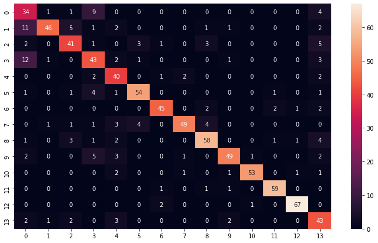

# Hand_Gesture_Recognition

This project is based on the architecture outlined in [this paper](https://github.com/guillaumephd/deep_learning_hand_gesture_recognition).

# I. Introduction

Gesture Recognition constitutes a vital subset within the realm of "computer vision," dedicated to deciphering human gestures through mathematical algorithms. While gestures can emanate from various bodily motions or states, they commonly originate from facial expressions or hand movements. This discipline encompasses diverse focuses, including emotion recognition from facial cues and the interpretation of hand gestures, enabling users to interact with devices through simple gestures without physical contact.

Numerous approaches have been explored, leveraging cameras and computer vision algorithms to interpret sign language. However, the scope of gesture recognition extends beyond sign language interpretation, encompassing the identification and understanding of postures, gaits, proxemics, and human behaviors. It represents a pivotal advancement, enabling computers to grasp human body language, thereby facilitating more intuitive interaction between humans and machines compared to conventional text-based or graphical user interfaces.

Gesture capture typically relies on two main methods:

1. **Wearable Sensors**: These include various sensor types such as flex, tactile, accelerometer, and gyroscope integrated into hand gloves. However, the utilization of wearable sensors presents limitations, notably in terms of cost-effectiveness, prompting current research to gravitate towards more straightforward computer vision methodologies.

2. **Computer Vision**: This technology harnesses a diverse array of cameras, including RGB, Depth, TOF (Time of Flight), Infrared, Thermal, and Stereo cameras, to capture a wide spectrum of images. Subsequently, machine learning algorithms process this data to segment and extract features such as skin color, skeletal structure, depth information, 3D models, and motion dynamics for further analysis.

Despite significant advancements, challenges persist in gesture recognition, spanning constraints imposed by diverse environmental conditions, such as scene background limitations and varying illumination conditions, as well as algorithmic accuracy for feature extraction, dataset characteristics, classification methodologies, and application-specific requirements.

# II. Problem Description

## Problem Statement:

"We require a model capable of identifying and classifying human hand gestures into predefined categories, either in real-time at each time step or upon completion of the gesture, utilizing captured 3D hand-skeletal data sequences."

Human gesture recognition falls within the broader framework of pattern recognition, involving two primary processes:

1. The acquisition process, which translates physical gestures into numerical data.
2. The interpretation process, which assigns meaning to the captured data.

### A. Importance of the Problem:

Gestures serve as a natural mode of communication, facilitating nonverbal intent communication among humans and enhancing human-computer interaction. By incorporating hand gestures, communication gains an additional layer of richness and nuance, akin to the subtle facial expressions accompanying verbal communication.

In today's context, where hygiene is paramount, gesture-based interaction offers a touch-free alternative, fostering safer human-computer interaction environments.

Moreover, hand gesture recognition holds significant potential for aiding sign language users, particularly individuals with hearing or speech impairments, enabling seamless communication within their community and with individuals who do not use sign language.

Furthermore, hand gestures play a pivotal role in surgical settings, allowing surgeons with covered mouths to communicate effectively while maintaining sterile conditions. The integration of gesture recognition technology in robotics within the medical field offers promising prospects, facilitating doctors' interactions with assistant robots during surgical procedures.

### B. Approaches to Addressing the Problem

Various approaches to hand gesture recognition based on computer vision have been explored, with recent advancements encompassing the following methods:

1. **Color-Based Recognition**: This approach relies on identifying skin color or colored gloves. Skin color detection typically involves converting the image to the YUV color space and applying a threshold to isolate skin tones. However, challenges arise under varying lighting conditions and when multiple objects share similar colors.

2. **Appearance-Based Recognition**: This method involves extracting image features to detect regions of interest (ROIs). Techniques such as Haar-like feature extraction and Adaboost classification are employed, along with background and foreground extraction. However, issues persist concerning lighting variations and background complexities.

3. **Motion-Based Recognition**: This technique involves extracting objects across a series of image frames using frame difference subtraction. It typically consists of two stages: hand detection and tracking in the first stage, followed by gesture classification in the second stage. Challenges include handling dynamic backgrounds.

4. **Skeleton-Based Recognition**: This approach utilizes geometric attributes such as joint orientation and spacing to detect complex features. It often integrates depth capture technologies like Kinect cameras and employs machine learning algorithms such as parallel convolutional neural networks (CNNs) or support vector machines (SVMs), along with Hidden Markov Models (HMMs) for classification.

5. **Depth-Based Recognition/3D Model**: This method leverages cameras such as Kinect to obtain 3D geometric information, enabling depth-based recognition.

6. **Deep Learning-Based Recognition**: This approach primarily utilizes convolutional neural networks (CNNs), which have demonstrated significant success in gesture recognition tasks.

While these techniques have shown promising results, most applications require classification of a small set of classes. Sign language recognition poses additional challenges due to the larger class set size.

In this project, we propose to build a model based on the methodology outlined in [2], falling under the category of deep learning-based recognition. Another relevant study, akin to our approach, utilizes depth images captured by Kinect sensors for color image segmentation, followed by skin color modeling and classification using CNNs and SVMs [3].

## How Did We Address the Problem?

### What Did We Start With?

#### A Pre-trained Deep Model trained on 14 hand gestures

The paper proposes the use of a multichannel convolutional network with two feature extraction modules and a residual branch per channel, as shown in the figure above.

The data is fed into multiple, fixed-length, 1D sequences ($s_1$, $s_2$, ..., $s_c$). Each channel has three branches - two of which have similar architectures designed for feature extraction. The input is passed through a convolution layer, followed by sub-sampling using a pooling layer. This process is repeated two more times.

For a single branch, the difference between all three convolutions resides in the number of feature maps used; the difference between the two branches resides in the size of the convolutions kernels. Having two kernel sizes for the time convolution layers allows the network to directly work at different time resolutions.  

The third branch in a channel works as a residual branch. Residual branches make it easier to optimize networks using a better gradient back-propagation in the training phase; also empirically improving the accuracy.

#### The 3D hand-skeleton dataset for 14 hand-gestures that the model was trained on

The Dynamic Hand Gesture-14/28 (DHG) dataset was created and introduced, \cite{10.2312:3dor.20171049} as a part of the SHREC2017-3D Shape retrieval Contest, as suggested in the paper. It consists of 3D hand skeletal representations returned by the Intel RealSense depth camera, corresponding to the 3D coordinates of 22 landmarks of the human hand.

#### Mediapipe framework

MediaPipe Hands is a high-fidelity hand and finger tracking solution \cite{zhang2020mediapipe},  \cite{mediapipe}. It employs machine learning (ML) to infer 21 3D landmarks of a hand from just a single frame.

## C. Our Adaptation:

With a multi-channel deep convolutional neural networks (MC-DCNN) model at hand and a ready-to-use hand skeleton dataset, our obvious approach comprised of retraining the model with an extra hand-gesture, as per our plan.
While re-training from scratch was an option, Transfer learning approach appeared faster and more suitable for adding 1 new gesture - a small data set.

Table \ref{gest_num_tab} lists the 15 gesture classes.

| # | Name of the gesture |
|---|---------------------|
| 1 | Grab                |
| 2 | Tap                 |
| 3 | Expand              |
| 4 | Pinch               |
| 5 | Rotation Clockwise  |
| 6 | Rotation Counter Clockwise |
| 7 | Swipe Right         |
| 8 | Swipe Left          |
| 9 | Swipe Up            |
| 10 | Swipe Down         |
| 11 | Swipe X            |
| 12 | Swipe +            |
| 13 | Swipe V            |
| 14 | Shake              |
| 15 | New Gesture = "Rock on" Sign |

The hand gesture we chose is the famous "Rock on" salute - Index finger up, middle fingers down, pinky up, thumb in or out.

### Gesture Recognition or Classification
The focus of this study lies in the classification stage, where features extracted from hand-skeletal data are used as inputs to a deep learning model to classify them into known labels.

In the Capture stage, most models utilize RGB-D image sequences, but our approach utilizes hand skeletal data sequences, which allows for quicker processing.

Feature extraction can be achieved through explicit hand-crafted features or implicit feature learning using deep learning algorithms. While deep learning algorithms implicitly learn features that often better describe the data, they may suffer from drawbacks such as overfitting and lack of generalization to unseen data.

The skeletal data consists of a sequence of 22 points representing hand-skeleton joints, where each joint represents a distinct articulation or part of the hand.

Convolutional Neural Networks (CNNs) process data through layers that perform convolution, pooling, and output dense layers. To effectively learn features, CNNs require a large volume of training data. Transfer learning and fine-tuning techniques are commonly employed to adapt pre-trained models to new tasks or datasets.

Incorporating external expert knowledge can lead to the use of simpler models or pre-processing techniques tailored to the specific task. For example, input data can be pre-processed to emphasize important features known to domain experts.

Sequence data exhibit time-domain dependencies, requiring specialized models such as Recurrent Neural Networks (RNNs) and Transformers. However, in this study, we propose a convolution-based architecture called Multi-channel Deep Convolutional Neural Networks (MC-DCNN), which does not use recurrent cells or attention mechanisms. MC-DCNNs process parallel unidimensional sequences and perform feature learning on each univariate sequence individually. This architecture is well-suited for skeleton data and offers advantages over other models by being agnostic to the skeleton's structure.

Overall, our approach combines deep learning techniques with specialized architectures tailored to the unique characteristics of hand gesture recognition tasks.

The steps we followed can be summed up as:

- **Data Capture**: Capturing a new hand gesture using our laptop camera.
- **Data Pre-process**: Transforming the captured image frames into 3D hand skeleton points dataset.
- **Model Preparation for Transfer Learning**: Adjusting the last fully connected layer of the model and freezing the others.
- **Training the Model**: Using the hand gesture data for 15 gestures.
- **Validation**: Hyper-parameter tuning and validating the accuracy.
- **Testing the Model**: Predicting using test data and evaluating the final accuracy.

#### Data Capture

We captured 100 frames of our new hand gesture, the "Rock on" sign, using a standard laptop camera and the MediaPipe framework \cite{mediapipepython}. This framework facilitated the conversion of hand images into 3D hand skeleton points datasets. To diversify our dataset, we manually augmented it by adjusting parameters such as thumb position, finger openness, and hand rotation.

#### Data Pre-processing

The original dataset comprised 22 data points, while our captures provided only 21. To reconcile this difference, we employed centroid calculation for the missing "Palm" landmark, utilizing the wrist, base of the index finger, and base of the little finger. This calculation enabled us to prepare the data for training.

The centroid of a finite set of k points {x_1, x_2,... ,x_k} in R^n is computed as:

C = (x_1 + x_2 + ... + x_k) / k

Each point having 3D coordinates, each training record became of size 100*66 (=22 * 3 coordinates). The dataset was then pickled into train and test subsets.

#### Model Preparation

The pre-trained model was loaded for transfer learning. The first 66 hidden layers were frozen while the last fully connected layer was modified to now accommodate 15 gestures instead of 14.

#### Training the Model

The model was then trained using transfer learning over multiple iterations and compositions of the 15-gesture dataset. The different approaches and outcomes are discussed in the results section.

#### Validation

Multiple iterations of tuning the model helped increase the accuracy as well as insights into the data compositions mentioned earlier.

#### Testing the Model

Finally, the model was tested on a test subset as well as freshly acquired human hand gestures.

## Results & Discussion

Validation, tuning, and testing the model demanded multiple iterations. This section will list out results of a few important iterations - in fact milestones in this journey.

### As-it-is Pre-trained Model: Original dataset

The confusion matrix for the crude pre-trained model on a test set can be seen in figure \ref{fig:cm_original}. It is almost diagonal without significant miss-classifications but gestures 2 (Tap) and 4 (Pinch) are sometimes miss-classified as gesture 1 (Grab), whereas gesture 1 is sometimes classified as gesture 4.

![Confusion Matrices and model accuracy]

### Re-training the Model

We have primarily focused on training data size and composition for our iterations. Usual methods of hyperparameter tuning used like varying learning rates, batch sizes and early stopping were pondered up on too. 

While 66 feature extraction layers, in our case, were frozen so that only the last fully connected layers of the model could be trained, lowering the learning rate (that usually helps while training hidden layers) did not seem to be of a great use. Our accuracy levels with a fixed learning rate were looking subpar; the number of weights to train were high; and we used a small dataset to train with - unchanged learning rate helped us sail through the training faster.

Transfer learning usually needs a smaller dataset so we decided that a good starting point was to select only $\approx$10\% of the available data for each class plus the same amount of samples from the new gesture.

#### Small and balanced data set

Proceed to retrain the model with small set of 20 samples of each class. In this setup, the training accuracy increased until 90\%, but the test accuracy stayed very low (\textless 50\%). With these results, our model was over-fitting to the training set but not performing good with general data.

#### Medium but imbalanced data set

Overfitting can be remedied by either applying regularization techniques or by increasing the training data. We decided to go with the latter and increased the samples to 100 for each of the old gestures and 20 for the new gesture. This was based on the observation that the model was performing well on the new gesture and suffered with the old gestures. The test accuracy increased this time to more or less 65\%, but we thought that we could do better.

#### Medium and more balanced dataset

So, we captured 10 more samples of the new gesture to try and balance the dataset, and turns out we did the right thing, since the accuracy test increased once again, this time to around 75\%, as seen in figure \ref{fig:acc_100_30}. The confusion matrix of the new model, in figure \ref{fig:cm_100_30} is almost a diagonal with only a few miss-classifications, the most common being the miss-classification of 12 (Swipe +) with 7 (Swipe Right), and more dispersed than what was seen in the original model.

## Decision Highlights

Some of the key decision-making during this project involved a lot of desk research and brainstorming. Here we list a few of them that defined the course of the path we took:

### Use Transfer Learning or Train from Scratch?

The paper and the model we handpicked for our project gave us access to the crude model as well the original dataset. This tempted us to train the model (tweaked on the last layer) from scratch for 15 gestures now. Should we choose to go this direction, feature selection on the 14 data gestures data - especially removing the missing "Palm" landmark in the mediapipe that we redundantly calculated using some of the other feature points - would benefit the model complexity. However, Transfer learning was a favored choice specially because it works with small data set, is faster and easier to re-train.

### Feature Selection or Pre-Processing for the missing Palm landmark?

Feature selection helps reduce model complexity especially through shorter training time and smaller space-usage. While it is attractive, it is not feasible with transfer learning to drop a few features on the re-train dataset. Hence, it was an informative choice to preprocess data and add the redundant missing data point, as discussed earlier.

### Data Augmentation using SMOTE Techniques?

Getting 30 training records of the same hand gesture manually is a cumbersome task and hence, our natural quest to find suitable techniques for data augmentation commenced. However, we soon realized that the way mediapipe works - where it directly sends us the hand landmarks and not the actual image info - techniques like SMOTE could not be used.

### Does the model over-fit if re-trained on the same 14 gestures?

In order to verify this, we tried re-training our pre-trained model on a dataset with just 20 samples from each of the 14 gestures in the original train dataset and re-trained the model. The test result on a totally new data set was 80\%. This trial negated our fear and indicated to continue going forward with our approach.

### Do we need architectural changes?

The original architecture was based on the features of 22 hand landmarks, since the palm landmark can be calculated from other landmarks, being redundant, the number of input features could be reduced to 21 (63 channels). That would result in a more compact model but would require a full training approach instead of transfer learning.

The classification layer of the model is composed of a fully connected layer with 1936 nodes (output of the convolution layers is flattened to 7128) followed by a final 14 node layer corresponding to one of each class. Other forms could be considered, such as SVM, decision trees, fewer nodes, and even removing the first layer in the classifier. The decision was to maintain the architecture because there's a great difference between the CNN layers' flattened output (7128) and the number of output nodes. Also, in deep learning architectures, fully connected layers are the usual choice to be used for classification, and SVM typically performs subpar \cite{DBLP:journals/corr/abs-1712-03541}. The new classification layer would only need to be extended to 15 output nodes instead of 14.

## Conclusion

A pre-trained deep learning model trained on a hand gesture dataset was handpicked, and transfer learning was applied to train it to additionally be able to classify a new gesture making it 15 gestures in total. Multiple iterations of the train-validate-test process were employed to reach acceptable model accuracy levels. Our approach mainly focused on varying data sizes and composition to get to a final accuracy level of 75%.

We can successfully conclude here that training a pre-trained model with a fraction of the original data-size helped us build a model with accuracy comparable to the original one, and an added capacity of classifying a new gesture.
